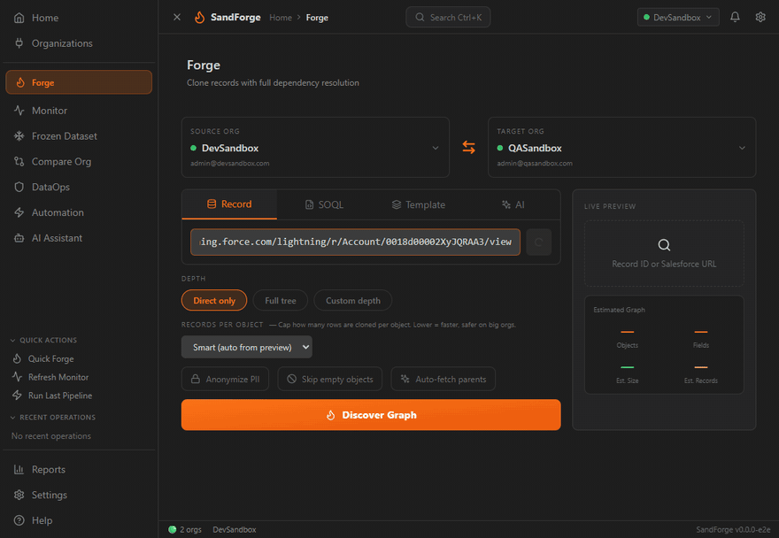

# SandForge: Salesforce DevOps Toolkit


**Forge your Salesforce sandboxes.** SandForge populates your developer sandbox with realistic data: cloned from a real record or generated synthetically, with production guardrails. One WebView UI, no Command Palette required.

---

## Your first clone in 2 minutes

1. **Connect your orgs**: click the SandForge icon in the Activity Bar, open **Organizations**, and click **Import from SF CLI** to pull in every org authenticated in the Salesforce CLI.
2. **Open Forge**: click the flame icon in the sidebar, or run **SandForge: Open Forge** from the Command Palette.
3. **Paste a root record ID** from your UAT sandbox into **Record ID or Salesforce URL** (an Account works well).
4. Click **Discover Graph**, then tune **Depth**, **Records per object**, and **Anonymize PII**.
5. Click **Review & Execute** toward your dev sandbox. Every ID is remapped automatically.



---

## Modules

SandForge ships 12 modules in a single extension:

| Module | What it does |
|---|---|
| **Forge** | Clone a record and its relationship graph between orgs, with BFS dependency discovery and automatic ID remapping |
| **Frozen Dataset** | Extract once, pseudonymize deterministically, replay identically after every sandbox refresh |
| **Seed** | Synthetic data from AI personas, templates, CSV import, or LLM-backed field rules |
| **Sync** | Bidirectional sync between orgs with field mapping, transforms, and conflict resolution |
| **Monitor** | API limits, jobs, storage, and health score in real time, with threshold alerts |
| **Compare** | Metadata diff, permission matrix, and drift detection across orgs |
| **DataOps** | Backup and restore, PII anonymization (GDPR, CCPA, HIPAA, PCI DSS), data quality rules |
| **Automation** | Visual pipeline builder with 15 step types, cron scheduling, and dry-run mode |
| **AI Assistant** | NL2SOQL and failed-job diagnosis over 10 read-only tools |
| **Grappe** | Parallel execution engine for datasets above 10,000 records |
| **Organizations** | Org registry with SF CLI import and tier-based safety coloring |
| **Reports** | Execution reports, operational analytics, audit trail, and data lineage |

Safety is on by default: Production Guard requires double confirmation before any write on a Production org, blocks DELETE there, and keeps an audit trail of operations.

---

## Documentation

| Guide | Description |
|---|---|
| [Getting Started](docs/getting-started.md) | Install, connect your org, run your first operation |
| [Forge: Dev Sandbox Quickstart](docs/forge-quickstart.md) | Clone a record graph from a partial-copy sandbox into your dev sandbox (wizard + CLI) |
| [Forge: Record-Scoped Architecture](docs/forge-record-scoped.md) | Internals of the scoped clone pipeline (BFS discovery, RecordType mapping, cycle 2-pass, orphan parent expansion) |
| [Frozen Dataset](docs/modules/frozen-dataset.md) | Replayable reference datasets |
| [Seed](docs/modules/seed.md) | AI generation, CSV import, org-to-org cloning |
| [Sync](docs/modules/sync.md) | Bidirectional data synchronization between orgs |
| [Monitor](docs/modules/monitor.md) | Real-time org health, API limits, and job tracking |
| [Compare](docs/modules/compare.md) | Metadata diff, permission matrix, and drift detection |
| [DataOps](docs/modules/dataops.md) | Backup, restore, anonymization, and data quality |
| [Automation](docs/modules/automation.md) | Visual pipeline builder with scheduling |
| [FAQ & Troubleshooting](docs/faq.md) | Common questions and solutions to frequent issues |

---

## Screenshots


---

## Requirements

| Requirement | Version |
|---|---|
| Visual Studio Code | 1.85+ |
| Salesforce CLI (`sf`) | Latest |
| Node.js | 18+ |
| pnpm | 9+ |
| AI API key (optional) | OpenAI, Anthropic, or Ollama |

---

## Installation

### From Marketplace (recommended)

1. Open VSCode
2. Go to Extensions (`Ctrl+Shift+X`)
3. Search for **SandForge**
4. Click **Install**

### From VSIX

Download `sandforge.vsix` from the [Releases](https://github.com/sandforge/sandforge/releases) page, then run **Extensions: Install from VSIX...** from the Command Palette.

### From Source

```bash
git clone https://github.com/sandforge/sandforge.git
cd sandforge
pnpm install
pnpm build
pnpm package
```

---

## Architecture

SandForge is a pnpm monorepo with three packages:

| Package | Description | Tech |
|---|---|---|
| `packages/shared` | Types, Zod schemas, constants, utilities | TypeScript strict |
| `packages/extension` | VSCode extension host, Salesforce API, orchestrators | Node.js, esbuild |
| `packages/webview` | React application, UI components, stores | Vite, Tailwind, Shadcn/ui |

The WebView talks to the extension host through a typed `postMessage` broker; every message is validated by Zod schemas at the boundary.

---

## Keyboard Shortcuts

| Shortcut | Action |
|---|---|
| `Ctrl+K` | Command Palette |
| `Ctrl+Shift+M` | Open Monitor |
| `Ctrl+Shift+D` | Open Seed |
| `Ctrl+Shift+Y` | Open Sync |
| `Ctrl+Shift+K` | Open Compare |
| `Ctrl+Shift+O` | Open DataOps |
| `Ctrl+Shift+A` | Open Automation |
| `Ctrl+Shift+G` | Open Orgs |

---

## Configuration

| Setting | Description | Default |
|---|---|---|
| `sandforge.language` | UI language (`en`, `fr`, `de`, `es`, `ja`, `pt-BR`) | `en` |
| `sandforge.telemetry` | Enable anonymous usage telemetry | `false` |
| `sandforge.ai.enabled` | Enable AI features | `true` |
| `sandforge.ai.provider` | AI provider (`openai`, `anthropic`, `ollama`) | `openai` |
| `sandforge.safety.requireProdConfirmation` | Require double confirmation for Production ops | `true` |
| `sandforge.grappe.enabled` | Enable parallel processing for large datasets | `true` |

See the full list of settings in the VSCode Settings UI under "SandForge".

---

## Internationalization

Full UI in 6 languages: English, French, German, Spanish, Japanese, Brazilian Portuguese. All UI text uses `t('key')` via react-i18next, and numbers, dates, and durations are formatted with Intl APIs.

---

## What's New

See the [CHANGELOG](changelog.md) for release notes. The extension is in preview: report issues on the [GitHub Issues](https://github.com/sandforge/sandforge/issues) page.

---

## Contributing

```bash
pnpm install          # Install dependencies
pnpm typecheck        # Type-check all packages (tsc --noEmit)
pnpm lint             # Lint with ESLint
pnpm test             # Run tests (Vitest)
pnpm build            # Build all packages
pnpm validate         # typecheck + lint + test + build
pnpm package          # Generate .vsix
```

Every `.ts` file must have a corresponding `.test.ts` in the same directory. The build must stay green at all times. TypeScript strict mode is enforced: no `any`, no unused locals. See [CONTRIBUTING.md](CONTRIBUTING.md) for details.

---

## Author

**Stephane Berthoz**

## License

[MIT](LICENSE)
