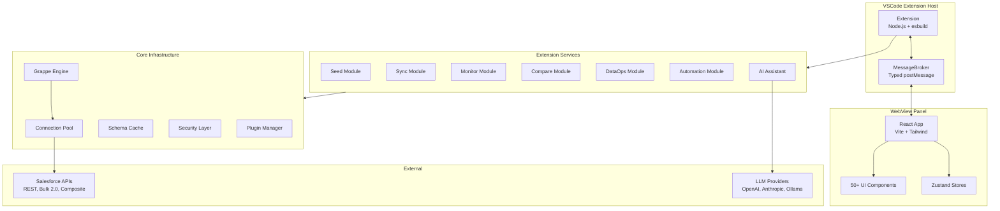

# SandForge 🔥 — Salesforce DevOps Toolkit


**Forge your Salesforce sandboxes.** A full-featured VSCode extension for ETL, data seeding, org monitoring, metadata comparison, compliance, and automation — all from a single WebView UI.

---

## Quick Start

1. **Install** — Search for **SandForge** in the [VSCode Marketplace](https://marketplace.visualstudio.com/items?itemName=StephaneBerthoz.sandforge) or install from the Extensions panel
2. **Connect** — Authenticate with your Salesforce org using Salesforce CLI credentials
3. **Forge** — Use the 5-step onboarding wizard to discover all 6 modules

---

## Screenshots


---

## Documentation

| Guide | Description |
|---|---|
| [Getting Started](docs/getting-started.md) | Install, connect your org, run your first operation |
| [Seed](docs/modules/seed.md) | AI-powered data generation with templates and dependency resolution |
| [Sync](docs/modules/sync.md) | Bidirectional data synchronization between orgs |
| [Monitor](docs/modules/monitor.md) | Real-time org health, API limits, and job tracking |
| [Compare](docs/modules/compare.md) | Metadata diff, permission matrix, and drift detection |
| [DataOps](docs/modules/dataops.md) | Backup, restore, anonymization, and data quality |
| [Automation](docs/modules/automation.md) | Visual pipeline builder with scheduling |
| [FAQ & Troubleshooting](docs/faq.md) | Common questions and solutions to frequent issues |

---

## Features

### Seed — AI-Powered Data Generation

- **8-Step Wizard** — Guided flow from object selection to execution with preview at every stage
- **AI Generation** — LLM-backed realistic data (OpenAI, Anthropic, Ollama) with 10 business personas
- **NL2SOQL** — Natural language to SOQL translation with schema validation and confidence scoring
- **Faker Profiles** — 30+ locale-aware Faker generators for names, addresses, emails, phones, and more
- **Template Engine** — Reusable JSON/CSV templates with variable interpolation and conditional logic
- **Dependency Resolution** — Automatic topological sort of parent-child relationships before insert
- **Dynamic Batch Optimizer** — Intelligent batch sizing based on object complexity and runtime performance

### Sync — Bidirectional Data Synchronization

- **4 Sync Modes** — Upsert, Insert, Update, and Delete with per-object configuration
- **7 Mapping Types** — Direct, Lookup, Formula, Constant, Concatenation, Conditional, and External ID
- **Smart Field Mapping** — AI-powered mapping suggestions based on name similarity and sample data
- **13 Transforms** — Uppercase, lowercase, trim, date format, number format, regex replace, and more
- **Conflict Resolution** — Last-write-wins, source-wins, target-wins, or manual merge strategies
- **Rollback** — Automatic savepoints with one-click rollback on partial failures
- **Migration Import** — Import configs from SFDMU and Gearset, plus CSV/JSON universal import

### Monitor — Real-Time Org Health

- **API Limits Tracking** — Live consumption of REST, Bulk, Streaming, and Metadata API quotas
- **Job Monitoring** — Apex jobs, Bulk jobs, and scheduled tasks with status and progress
- **Alert System** — Configurable thresholds with severity levels and notification channels
- **Trend Analysis** — Historical charts with predictive analytics for API usage, storage, and records
- **Health Score** — Composite score aggregating limits, jobs, storage, and error rates
- **Anomaly Detection** — Statistical outlier detection with IQR, temporal patterns, and fuzzy duplicates

### Compare — Metadata Diff & Permissions

- **Metadata Diff** — Side-by-side comparison of fields, objects, flows, Apex classes, and profiles
- **Permission Matrix** — Visual grid of CRUD and FLS permissions across profiles and permission sets
- **Drift Detection** — Scheduled scans that flag configuration drift between production and sandboxes
- **Impact Graph** — Interactive dependency visualization showing downstream effects of changes
- **Deploy from Diff** — Select individual metadata differences and deploy them directly

### DataOps — Backup, Compliance & Quality

- **Backup & Restore** — Full or incremental backups with point-in-time restore and retention policies
- **GDPR Anonymization** — PII detection and anonymization compliant with GDPR, CCPA, HIPAA, PCI DSS
- **PII Detector** — Triple detection: field names + regex patterns + content sampling
- **Data Quality Engine** — 7 rule types: completeness, format, consistency, uniqueness, range, pattern, custom
- **Production Guard** — 3 safety tiers with double confirmation for Production, DELETE blocking, audit trail
- **Encryption at Rest** — AES-256-GCM with PBKDF2 key derivation for sensitive data

### Automation — Visual Pipeline Builder

- **Visual Pipeline Builder** — Drag-and-drop canvas for composing automation steps
- **15 Step Types** — Query, Transform, Load, Validate, Notify, Branch, Loop, Wait, Approval, and more
- **Pipeline Marketplace** — 15 pre-configured templates across 5 categories
- **Approval Gates** — Multi-approver workflows with configurable timeout and default action
- **Pipeline Versioning** — Git-like history with diff, rollback, tags, and annotations
- **Dry Run Mode** — Simulated execution with impact preview before running for real
- **Scheduling** — Cron expressions with timezone support and calendar-based exclusions

### AI Assistant

- **NL2SOQL** — Query Salesforce in plain language (French and English)
- **Error Resolver** — Contextual Salesforce error analysis with auto-fix and learning
- **AI Code Reviewer** — Apex best practices, security, and performance suggestions
- **Predictive Analytics** — Trend forecasting for API limits, storage, and record growth
- **10 Business Personas** — Pre-configured data profiles (Startup, Enterprise, Healthcare, etc.)

### Real-Time Operations Dashboard

- **LiveOperationTracker** -- Live DML operation monitoring with per-object throughput, progress bars, and event streaming
- **Governor Limit Awareness** -- Automatic parsing of `Sforce-Limit-Info` headers with proactive throttling alerts
- **Org Tier Detection** -- API thresholds adapt to your sandbox tier (Developer, Developer Pro, Partial, Full)

### Data Masking Templates

- **MaskingTemplateService** -- Pre-built anonymization templates for GDPR, HIPAA, and PCI DSS compliance
- **Custom Templates** -- Define field-level masking rules with preview before execution
- **Template Sharing** -- Export and import masking configurations across teams

### Configuration Profiles

- **ConfigProfileManager** -- Save complete sandbox provisioning configurations as named profiles
- **Profile Switching** -- Quickly switch between different org configurations (dev, QA, staging, UAT)
- **Team Sharing** -- Export profiles as JSON for consistent team-wide settings

### Security & Governance

- **CrudFlsGuard** -- Enforces CRUD and FLS permission checks before every Salesforce DML operation
- **DmlOperationTracker** -- Tracks cumulative DML operations to prevent governor limit violations
- **Zod-Validated Bridge** -- All WebView-to-extension messages validated by Zod schemas at the MessageBroker level

### Extensibility

- **Plugin System** — 6 extension points (beforeSeed, afterSync, onError, transform, validate, notify)
- **CI/CD Integration** — Ready-made configs for GitHub Actions, GitLab CI, Jenkins, Azure DevOps
- **Team Configuration** — Shareable `.sandforge.json` for consistent team settings
- **Telemetry** — Opt-in anonymous usage analytics (privacy-first, no PII)

---

## Requirements

| Requirement | Version |
|---|---|
| Visual Studio Code | 1.85+ |
| Salesforce CLI (`sf`) | Latest |
| Node.js | 18+ |
| pnpm | 9+ |
| AI API Key (optional) | OpenAI, Anthropic, or Ollama |

---

## Installation

### From Marketplace (recommended)

1. Open VSCode
2. Go to Extensions (`Ctrl+Shift+X`)
3. Search for **SandForge**
4. Click **Install**

### From VSIX

1. Download `sandforge.vsix` from the [Releases](https://github.com/sandforge/sandforge/releases) page
2. In VSCode: `Ctrl+Shift+P` then **Extensions: Install from VSIX...**
3. Select the downloaded file

### From Source

```bash
git clone https://github.com/sandforge/sandforge.git
cd sandforge
pnpm install
pnpm build
pnpm package
```

---

## Keyboard Shortcuts

| Shortcut | Action |
|---|---|
| `Ctrl+K` | Command Palette |
| `Ctrl+Shift+M` | Open Monitor |
| `Ctrl+Shift+D` | Open Seed |
| `Ctrl+Shift+Y` | Open Sync |
| `Ctrl+Shift+K` | Open Compare |
| `Ctrl+Shift+O` | Open DataOps |
| `Ctrl+Shift+A` | Open Automation |
| `Ctrl+Shift+G` | Open Orgs |

---

## Configuration

| Setting | Description | Default |
|---|---|---|
| `sandforge.language` | UI language (`en`, `fr`, `de`, `es`, `ja`, `pt-BR`) | `en` |
| `sandforge.telemetry` | Enable anonymous usage telemetry | `false` |
| `sandforge.ai.enabled` | Enable AI features | `true` |
| `sandforge.ai.provider` | AI provider (`openai`, `anthropic`, `ollama`) | `openai` |
| `sandforge.safety.requireProdConfirmation` | Require double confirmation for Production ops | `true` |
| `sandforge.grappe.enabled` | Enable parallel processing for large datasets | `true` |

See the full list of 14+ settings in the VSCode Settings UI under "SandForge".

---

## Architecture

SandForge is a **pnpm monorepo** with three packages:

| Package | Description | Tech |
|---|---|---|
| `packages/shared` | Types, Zod schemas, constants, utilities | TypeScript strict |
| `packages/extension` | VSCode extension host, Salesforce API, orchestrators | Node.js, esbuild |
| `packages/webview` | React application, UI components, stores | Vite, Tailwind, Shadcn/ui |



---

## Internationalization

SandForge supports 6 languages from day one:

| Language | Code | Status |
|---|---|---|
| English | `en` | Complete |
| French | `fr` | Complete |
| German | `de` | Complete |
| Spanish | `es` | Complete |
| Japanese | `ja` | Complete |
| Brazilian Portuguese | `pt-BR` | Complete |

All UI text uses `t('key')` via react-i18next. Locale-aware formatters handle numbers, dates, currencies, durations, file sizes, and relative time using Intl APIs.

---

## What's New in 1.0.0

First public release of SandForge on the VSCode Marketplace.

- 6 core modules: Seed, Sync, Monitor, Compare, DataOps, Automation
- AI Assistant with NL2SOQL, Schema Advice, and Pipeline Generator
- Grappe Engine for parallel processing of large datasets
- Production Guard with 3 safety tiers
- 162 Playwright E2E tests + comprehensive unit test suite
- 3-OS CI matrix (Ubuntu, macOS, Windows)
- VSIX optimized to 1.07 MB

See the full [CHANGELOG](changelog.md) for details.

## Known Issues

This extension is currently in **preview**. Please report any issues on the [GitHub Issues](https://github.com/sandforge/sandforge/issues) page.

---

## Contributing

```bash
pnpm install          # Install dependencies
pnpm typecheck        # Type-check all packages (tsc --noEmit)
pnpm lint             # Lint with ESLint
pnpm lint:fix         # Auto-fix lint issues
pnpm test             # Run tests (Vitest)
pnpm build            # Build all packages
pnpm validate         # typecheck + lint + test + build
pnpm package          # Generate .vsix
```

Every `.ts` file must have a corresponding `.test.ts` in the same directory. The build must stay green at all times. TypeScript strict mode is enforced — no `any`, no unused locals.

---

## Author

**Stephane Berthoz**

## License

[MIT](LICENSE)
