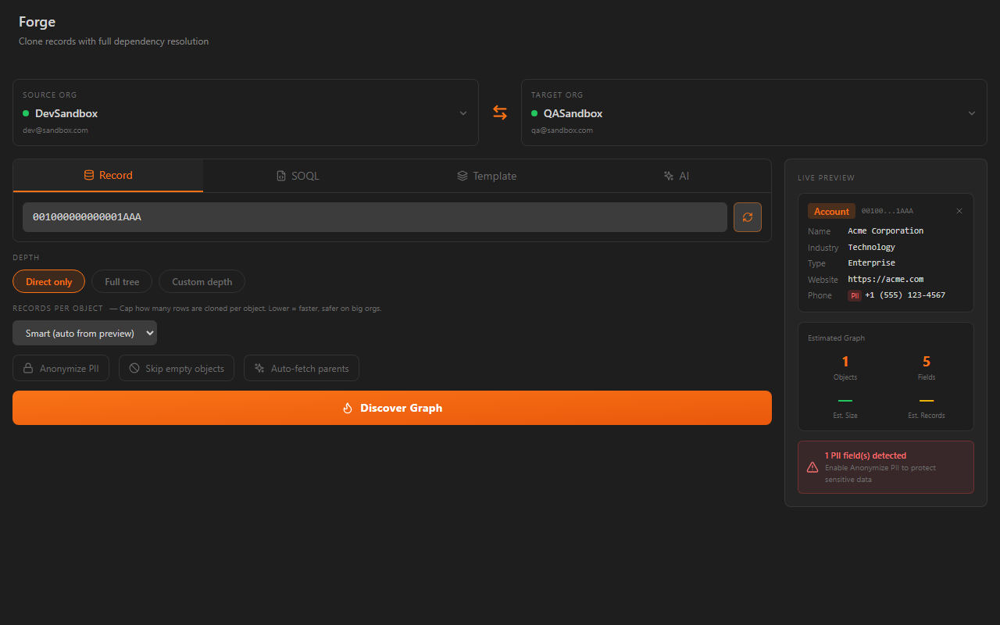
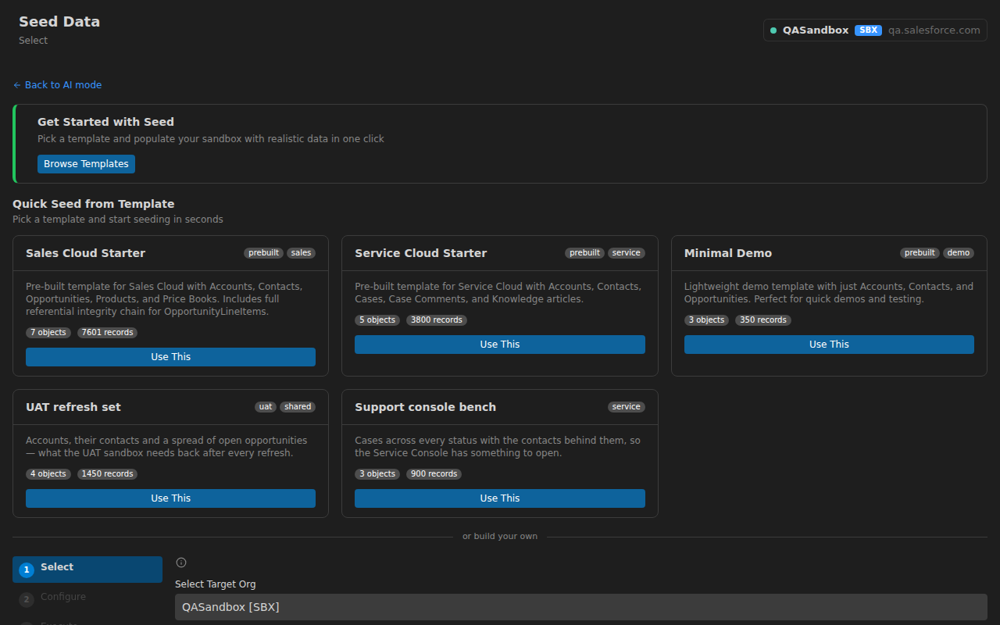
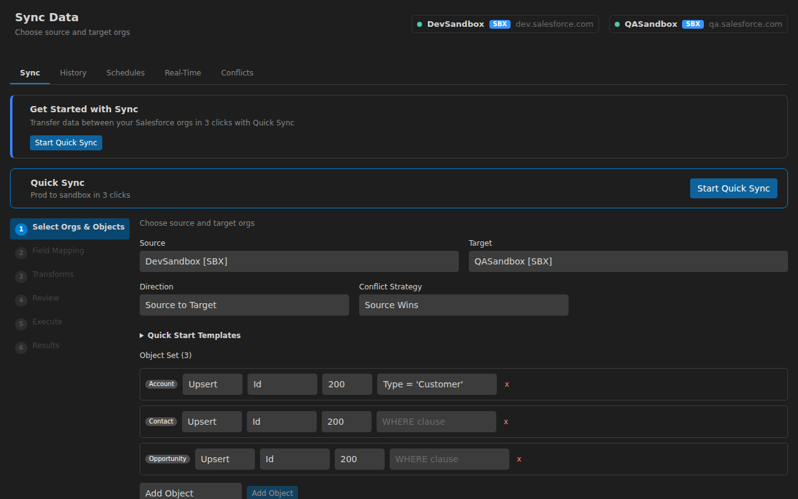
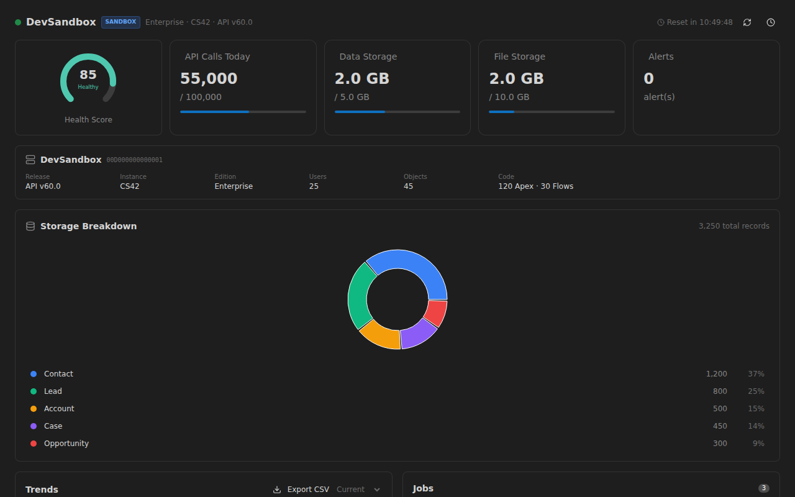
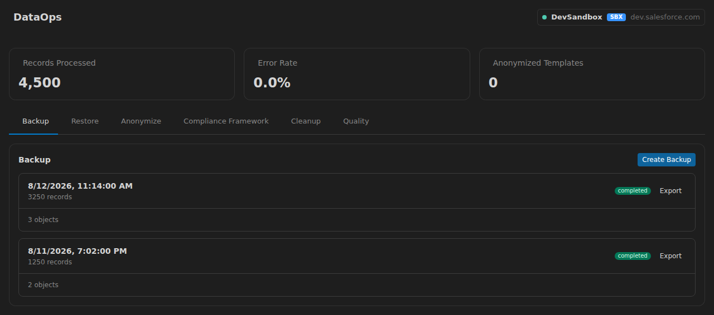

# SandForge: Salesforce DevOps Toolkit

<!-- badges:start -->


[](https://github.com/StephaneBerthoz/sandforge/actions/workflows/ci.yml)


<!-- badges:end -->

**Forge your Salesforce sandboxes.** SandForge populates your developer sandbox with realistic data: cloned from a real record or generated synthetically, with production guardrails. One WebView UI, no Command Palette required.

---

## Why switch from SFDMU or Data Loader?

- **No config file to author.** Paste a record ID: BFS discovery walks the relationship graph for you and every lookup is remapped on write. No `export.json` to hand-write, no field mapping to keep in step with the schema.
- **No mandatory CSV round-trip.** Records move org to org over the API. CSV import is still there when you want it — one door in, not the only one.
- **Production Guard on by default.** Double confirmation before any write to a Production org, DELETE blocked outright, operations logged. Nothing to switch on, nothing to remember.
- **Your existing SFDMU config keeps working.** The Migration module imports an `export.json` into a Sync config, so what you already built comes with you.

---

## Your first clone in 2 minutes

1. **Connect your orgs**: click the SandForge icon in the Activity Bar, open **Organizations**, and click **Import from SF CLI** to pull in every org authenticated in the Salesforce CLI.
2. **Open Forge**: click the flame icon in the sidebar, or run **SandForge: Open Forge** from the Command Palette.
3. **Paste a root record ID** from your UAT sandbox into **Record ID or Salesforce URL** (an Account works well).
4. Click **Discover Graph**, then tune **Depth**, **Records per object**, and **Anonymize PII**.
5. Click **Review & Execute** toward your dev sandbox. Every ID is remapped automatically.



---

## Modules

SandForge ships 14 modules in a single extension:

| Module             | What it does                                                                                                                                                                                             |
| ------------------ | -------------------------------------------------------------------------------------------------------------------------------------------------------------------------------------------------------- |
| **Forge**          | Clone a record and its relationship graph between orgs, with BFS dependency discovery and automatic ID remapping                                                                                         |
| **Frozen Dataset** | Extract once, pseudonymize deterministically, replay identically after every sandbox refresh                                                                                                             |
| **Seed**           | Synthetic data from AI personas, templates, CSV import, or LLM-backed field rules                                                                                                                        |
| **Sync**           | Bidirectional sync between orgs with field mapping, transforms, and conflict resolution                                                                                                                  |
| **Monitor**        | API limits, jobs, storage, and health score in real time, with threshold alerts                                                                                                                          |
| **Compare**        | Metadata diff, permission matrix, and drift detection across orgs                                                                                                                                        |
| **DataOps**        | Org backup, restore from any backup, and PII anonymization templates _(compliance workflows and quality rules coming soon)_                                                                              |
| **Automation**     | Visual pipeline builder with 15 step types and dry-run mode (scheduling and triggers coming soon)                                                                                                        |
| **AI Assistant**   | NL2SOQL and failed-job diagnosis over 10 read-only tools                                                                                                                                                 |
| **Grappe**         | Per-partition progress reporting for large Seed, Sync and Autopilot runs, behind `sandforge.grappe.enabled` (off by default). Execution itself is sequential — this splits the _reporting_, not the work |
| **Migration**      | Import existing SFDMU `export.json` or CSV configurations into Sync configs                                                                                                                              |
| **Autopilot**      | Zero-config sandbox seeding through a guided wizard, with GDPR, CCPA, HIPAA and PCI-DSS anonymization rule sets                                                                                          |
| **Organizations**  | Org registry with SF CLI import and tier-based safety coloring                                                                                                                                           |
| **Reports**        | Execution reports, operational analytics, audit trail, and data lineage _(coming soon — the views ship, the data feed does not)_                                                                         |

Safety is on by default: Production Guard requires double confirmation before any write on a Production org, blocks DELETE there, and keeps an audit trail of operations.

---

## Documentation

| Guide                                                            | Description                                                                                                       |
| ---------------------------------------------------------------- | ----------------------------------------------------------------------------------------------------------------- |
| [Getting Started](docs/getting-started.md)                       | Install, connect your org, run your first operation                                                               |
| [Forge: Dev Sandbox Quickstart](docs/forge-quickstart.md)        | Clone a record graph from a partial-copy sandbox into your dev sandbox (wizard + CLI)                             |
| [Forge: Record-Scoped Architecture](docs/forge-record-scoped.md) | Internals of the scoped clone pipeline (BFS discovery, RecordType mapping, cycle 2-pass, orphan parent expansion) |
| [Frozen Dataset](docs/modules/frozen-dataset.md)                 | Replayable reference datasets                                                                                     |
| [Seed](docs/modules/seed.md)                                     | AI generation, CSV import, org-to-org cloning                                                                     |
| [Sync](docs/modules/sync.md)                                     | Bidirectional data synchronization between orgs                                                                   |
| [Monitor](docs/modules/monitor.md)                               | Real-time org health, API limits, and job tracking                                                                |
| [Compare](docs/modules/compare.md)                               | Metadata diff, permission matrix, and drift detection                                                             |
| [DataOps](docs/modules/dataops.md)                               | Backup, restore and anonymization (compliance and quality coming soon)                                            |
| [Automation](docs/modules/automation.md)                         | Visual pipeline builder (scheduling and triggers coming soon)                                                     |
| [FAQ & Troubleshooting](docs/faq.md)                             | Common questions and solutions to frequent issues                                                                 |

---

## Screenshots










---

## Requirements

| Requirement           | Version            |
| --------------------- | ------------------ |
| Visual Studio Code    | 1.95+              |
| Salesforce CLI (`sf`) | Latest             |
| Node.js               | 22                 |
| pnpm                  | 11                 |
| AI API key (optional) | Anthropic (Claude) |

---

## Installation

### From Marketplace (recommended)

1. Open VSCode
2. Go to Extensions (`Ctrl+Shift+X`)
3. Search for **SandForge**
4. Click **Install**

### From VSIX

Download `sandforge.vsix` from the [Releases](https://github.com/StephaneBerthoz/sandforge/releases) page, then run **Extensions: Install from VSIX...** from the Command Palette.

### From Source

```bash
git clone https://github.com/StephaneBerthoz/sandforge.git
cd sand-forge
pnpm install
pnpm build
pnpm package
```

---

## Architecture

SandForge is a pnpm monorepo with three packages:

| Package              | Description                                          | Tech                      |
| -------------------- | ---------------------------------------------------- | ------------------------- |
| `packages/shared`    | Types, Zod schemas, constants, utilities             | TypeScript strict         |
| `packages/extension` | VSCode extension host, Salesforce API, orchestrators | Node.js, esbuild          |
| `packages/webview`   | React application, UI components, stores             | Vite, Tailwind, Shadcn/ui |

The WebView talks to the extension host through a typed `postMessage` broker; every message is validated by Zod schemas at the boundary.

---

## Keyboard Shortcuts

| Shortcut       | Action          |
| -------------- | --------------- |
| `Ctrl+Shift+R` | Open Grappe     |
| `Ctrl+Shift+A` | Open Automation |

On macOS, use `Cmd` instead of `Ctrl`.

---

## Configuration

| Setting                                    | Description                                                    | Default                      |
| ------------------------------------------ | -------------------------------------------------------------- | ---------------------------- |
| `sandforge.telemetry`                      | Enable anonymous usage telemetry                               | `false`                      |
| `sandforge.seed.defaultBatchSize`          | Default batch size for Seed data operations                    | `200`                        |
| `sandforge.sync.defaultBatchSize`          | Default batch size for Sync data operations                    | `200`                        |
| `sandforge.sync.maxConcurrentOps`          | Maximum concurrent sync operations                             | `3`                          |
| `sandforge.ai.enabled`                     | Enable the AI Assistant (requires an API key)                  | `false`                      |
| `sandforge.ai.provider`                    | AI provider (`anthropic` supported; `openai`/`custom` planned) | `anthropic`                  |
| `sandforge.ai.model`                       | AI model used by the assistant                                 | `claude-sonnet-4-5-20250929` |
| `sandforge.ai.tokenBudgetMaxPerSession`    | Maximum AI token budget per Assistant panel session            | `50000`                      |
| `sandforge.backup.maxCount`                | Maximum number of backups retained per org                     | `10`                         |
| `sandforge.pipeline.timeout`               | Pipeline execution timeout (ms)                                | `300000`                     |
| `sandforge.safety.requireProdConfirmation` | Require confirmation for Production org operations             | `true`                       |
| `sandforge.safety.auditLogging`            | Enable audit logging for all data operations                   | `true`                       |

See the full list of settings in the VSCode Settings UI under "SandForge".

---

## Internationalization

Full UI in 6 languages: English, French, German, Spanish, Japanese, Brazilian Portuguese. All UI text uses `t('key')` via react-i18next, and numbers and dates are formatted with Intl APIs using the editor locale. Durations are not: they are composed from fixed `h`/`min`/`s`/`ms` tokens and read the same in every locale.

---

## What's New

See the [CHANGELOG](changelog.md) for release notes. Report issues on the [GitHub Issues](https://github.com/StephaneBerthoz/sandforge/issues) page.

---

## Contributing

```bash
pnpm install          # Install dependencies
pnpm typecheck        # Type-check all packages (tsc --noEmit)
pnpm lint             # Lint with ESLint
pnpm test             # Run tests (Vitest)
pnpm build            # Build all packages
pnpm validate         # typecheck + lint + test + build
pnpm package          # Generate .vsix
```

Every `.ts` file must have a corresponding `.test.ts` in the same directory. The build must stay green at all times. TypeScript strict mode is enforced: no `any`, no unused locals. See [CONTRIBUTING.md](CONTRIBUTING.md) for details.

---

## Author

**Stephane Berthoz**

## License

[MIT](LICENSE)
