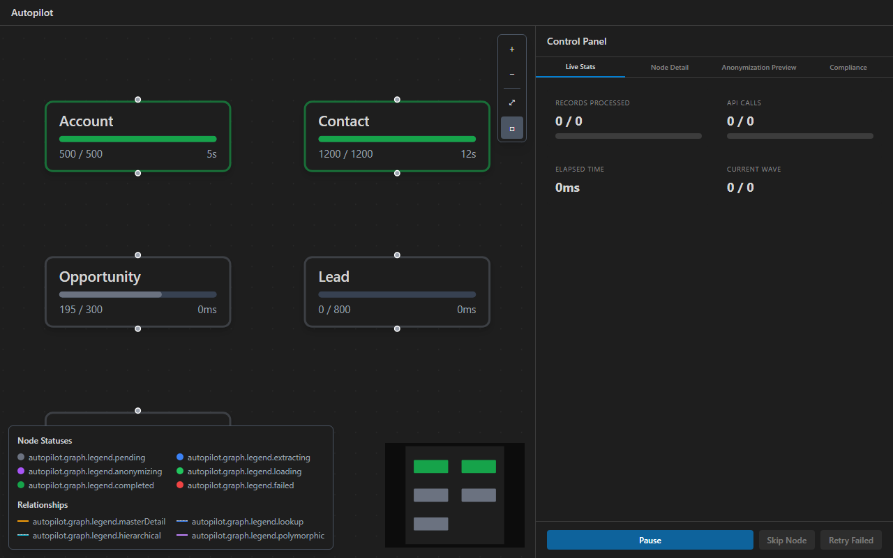
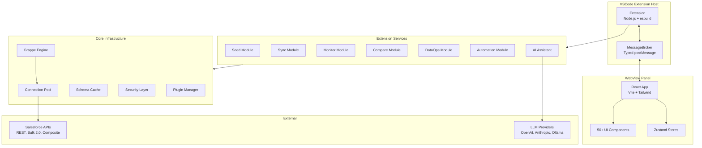

# SandForge: Salesforce DevOps Toolkit


**Forge your Salesforce sandboxes.** A VSCode extension for ETL, data seeding, org monitoring, metadata comparison, compliance, and automation, all from a single WebView UI.

---

## Quick Start

1. **Install**: Search for **SandForge** in the [VSCode Marketplace](https://marketplace.visualstudio.com/items?itemName=StephaneBerthoz.sandforge) or install from the Extensions panel
2. **Connect**: Authenticate with your Salesforce org using Salesforce CLI credentials
3. **Forge**: Use the 5-step onboarding wizard to discover all 6 modules

---

## Screenshots




---

## Documentation

| Guide | Description |
|---|---|
| [Getting Started](docs/getting-started.md) | Install, connect your org, run your first operation |
| **[Forge: Dev Sandbox Quickstart](docs/forge-quickstart.md)** | **Clone a record graph from a partial-copy sandbox into your dev sandbox in 60s (wizard + CLI)** |
| [Forge: Record-Scoped Architecture](docs/forge-record-scoped.md) | Internals of the scoped clone pipeline (BFS discovery, RecordType mapping, cycle 2-pass, orphan parent expansion, picklist strip) |
| [Seed](docs/modules/seed.md) | AI generation, CSV import, and org-to-org cloning with templates and dependency resolution |
| [Sync](docs/modules/sync.md) | Bidirectional data synchronization between orgs |
| [Monitor](docs/modules/monitor.md) | Real-time org health, API limits, and job tracking |
| [Compare](docs/modules/compare.md) | Metadata diff, permission matrix, and drift detection |
| [DataOps](docs/modules/dataops.md) | Backup, restore, anonymization, and data quality |
| [Automation](docs/modules/automation.md) | Visual pipeline builder with scheduling |
| [Frozen Reference Dataset](docs/modules/frozen-dataset.md) | Extract once, pseudonymize deterministically, replay identically after every sandbox refresh |
| [FAQ & Troubleshooting](docs/faq.md) | Common questions and solutions to frequent issues |

---

## Features

### Seed: AI Generation, CSV Import & Org Cloning

- **3 Seed Modes**: AI Generate, CSV Upload, or Clone from Org (card-based mode selector)
- **AI Personas**: 10 industry-specific personas (Insurance FR, Hospital US, etc.) with locale badges and preview popover showing 5 sample records
- **Smart Actions**: Home Dashboard analyzes your orgs and recommends the best action (clone, quick-seed, or sync) with a one-click "Just Do It" CTA
- **Quick Seed**: Select a template, pick your org, seed in 1 click (no field config needed)
- **CSV Import**: Drag-and-drop CSV upload with auto column mapping, inline validation, and 4-step wizard (Upload, Map, Validate, Execute)
- **Clone from Org**: Clone records between orgs with relationship-ordered insert, per-object SOQL filters, and ID mapping export
- **Template Gallery**: 3 pre-built templates (Sales Cloud, Service Cloud, Minimal Demo) + save your own
- **Adaptive Wizard**: Auto-advance for small selections (<5 objects), grouped accordion for large ones (>20 objects)
- **Locale-Aware Generation**: Realistic data in 6 locales (en, fr, de, es, ja, pt-BR) with geo-coherent addresses
- **VR-Aware Generation**: Auto-adjusts field rules to satisfy your org's validation rules
- **AI Generation**: LLM-backed realistic data (OpenAI, Anthropic, Ollama) with customizable persona field patterns
- **Faker Profiles**: 30+ locale-aware Faker generators for names, addresses, emails, phones, and more
- **Template Engine**: Reusable JSON/CSV templates with variable interpolation and conditional logic
- **Dependency Resolution**: Automatic topological sort of parent-child relationships before insert

### Sync: Bidirectional Data Synchronization

- **Quick Sync**: 3-click flow: pick orgs, select objects, go (auto-field mapping, smart defaults)
- **CDC Real-Time Sync**: Change Data Capture subscriptions with live event feed, auto-sync toggle, and watchdog reconnection
- **Conflict Resolution UI**: Side-by-side diff viewer (2-way + 3-way) with per-field resolution and bulk actions
- **Sync History**: Full execution history (500 entries) with detail view and one-click re-run
- **Cron Scheduling**: Visual builder + raw expression with timezone support, sleep/wake resilient
- **Smart Object Suggestions**: Top 5 most-used objects suggested with one-click add
- **Relationship Auto-Detection**: Adding "Opportunity" auto-suggests "Account" as parent dependency
- **Pre-Built Sync Templates**: Full Account Hierarchy, Opportunities + Products, Cases + Attachments
- **4 Sync Modes**: Upsert, Insert, Update, and Delete with per-object configuration
- **7 Mapping Types**: Direct, Lookup, Formula, Constant, Concatenation, Conditional, and External ID
- **Smart Field Mapping**: AI-powered mapping suggestions based on name similarity and sample data
- **13 Transforms**: Uppercase, lowercase, trim, date format, number format, regex replace, and more
- **5 Conflict Strategies**: Last-write-wins, source-wins, target-wins, manual merge, or auto-merge
- **Rollback**: Automatic savepoints with one-click rollback on partial failures
- **Config Persistence**: Save, load, and reuse sync configurations across sessions

### Monitor: Real-Time Org Health

- **API Limits Tracking**: Live consumption of REST, Bulk, Streaming, and Metadata API quotas
- **Job Monitoring**: Apex jobs, Bulk jobs, and scheduled tasks with status and progress
- **Alert System**: Configurable thresholds with severity levels and notification channels
- **Trend Analysis**: Historical charts with predictive analytics for API usage, storage, and records
- **Health Score**: Composite score aggregating limits, jobs, storage, and error rates
- **Anomaly Detection**: Statistical outlier detection with IQR, temporal patterns, and fuzzy duplicates

### Compare: Metadata Diff & Permissions

- **Metadata Diff**: Side-by-side comparison of fields, objects, flows, Apex classes, and profiles
- **Permission Matrix**: Visual grid of CRUD and FLS permissions across profiles and permission sets
- **Drift Detection**: Scheduled scans that flag configuration drift between production and sandboxes
- **Impact Graph**: Interactive dependency visualization showing downstream effects of changes
- **Deploy from Diff**: Select individual metadata differences and deploy them directly

### DataOps: Backup, Compliance & Quality

- **Backup & Restore**: Full or incremental backups with point-in-time restore and retention policies
- **GDPR Anonymization**: PII detection and anonymization compliant with GDPR, CCPA, HIPAA, PCI DSS
- **PII Detector**: Triple detection: field names + regex patterns + content sampling
- **Data Quality Engine**: 7 rule types: completeness, format, consistency, uniqueness, range, pattern, custom
- **Production Guard**: 3 safety tiers with double confirmation for Production, DELETE blocking, audit trail
- **Encryption at Rest**: AES-256-GCM with PBKDF2 key derivation for sensitive data

### Automation: Visual Pipeline Builder

- **Visual Pipeline Builder**: Drag-and-drop canvas for composing automation steps
- **15 Step Types**: Query, Transform, Load, Validate, Notify, Branch, Loop, Wait, Approval, and more
- **Pipeline Marketplace**: 15 pre-configured templates across 5 categories
- **Approval Gates**: Multi-approver workflows with configurable timeout and default action
- **Pipeline Versioning**: Git-like history with diff, rollback, tags, and annotations
- **Dry Run Mode**: Simulated execution with impact preview before running for real
- **Scheduling**: Cron expressions with timezone support and calendar-based exclusions

### Streaming & Background Execution

- **Streaming Pipeline**: Async generator-based chunk processing for datasets > 10,000 records
- **Chunked Bulk API 2.0**: Multi-upload to a single Bulk API job (2000 records/chunk) for optimal throughput
- **Background Operations**: Long-running operations detach from the UI and run in the background
- **Abort Support**: Cancel any running background operation via AbortController
- **Operation Dashboard**: Query status, list active operations, abort by ID from the WebView
- **Native Notifications**: VSCode desktop notifications when background operations complete while panel is hidden

### AI Assistant

- **Read-only by design**: 10 fine-grained read-only tools (`describe_object`, `query_records`, `get_limits`, `get_recent_errors`, `get_apex_log`, `get_metadata`, `get_alerts`, `get_anomalies`, `list_sobjects`, `validate_soql`). DML keywords rejected at two layers. Registry CI fence rejects any future write-verb addition.
- **Failed-job diagnose flow**: Right-click a failed bulk job in Monitor → "Diagnose with AI" surfaces a structured `DiagnoseResult` ActionCard (Approve / Reject / Modify) inside the chat panel. Read-only suggested actions auto-execute silently; org-mutating ones (`requiresApproval=true`) gate behind the inline Approve button.
- **Per-provider CircuitBreaker**: 3 consecutive 529s open the breaker for 5 min. `AnthropicAdapter` functional today; `OpenAIAdapter` and `CustomAdapter` ship as stubs that satisfy the interface (provider switch in Settings does not crash the extension).
- **Per-AI-request AbortController**: Cancel one chat without aborting siblings. The Cancel button never trips the breaker.
- **Per-panel-session token budget**: Mini-bar status indicator with 4-field tooltip. Soft warn at 80%, hard refuse at 100% via preflight BEFORE the SDK call. Configurable via `sandforge.ai.tokenBudgetMaxPerSession` (default 50000).
- **Prompt-injection defence verified adversarially**: `<user-data>` is an actual safety boundary, not just a prompt-template wrapper. 7 jailbreak fixtures × 2 defence layers + spotlight system prompts asserted in CI.
- **Zod-validated structured output**: `messages.parse + zodOutputFormat` for new flows (no regex-extract JSON parsing).
- **NL2SOQL**: Query Salesforce in plain language (French and English).
- **10 Industry Personas**: Pre-configured data profiles with locale-aware field patterns and sample preview.

### Real-Time Operations Dashboard

- **LiveOperationTracker** -- Live DML operation monitoring with per-object throughput, progress bars, and event streaming
- **Governor Limit Awareness** -- Automatic parsing of `Sforce-Limit-Info` headers with proactive throttling alerts
- **Org Tier Detection** -- API thresholds adapt to your sandbox tier (Developer, Developer Pro, Partial, Full)

### Data Masking Templates

- **MaskingTemplateService** -- Pre-built anonymization templates for GDPR, HIPAA, and PCI DSS compliance
- **Custom Templates** -- Define field-level masking rules with preview before execution
- **Template Sharing** -- Export and import masking configurations across teams

### Configuration Profiles

- **ConfigProfileManager** -- Save complete sandbox provisioning configurations as named profiles
- **Profile Switching** -- Quickly switch between different org configurations (dev, QA, staging, UAT)
- **Team Sharing** -- Export profiles as JSON for consistent team-wide settings

### Security & Governance

- **CrudFlsGuard** -- Enforces CRUD and FLS permission checks before every Salesforce DML operation
- **DmlOperationTracker** -- Tracks cumulative DML operations to prevent governor limit violations
- **Zod-Validated Bridge** -- All WebView-to-extension messages validated by Zod schemas at the MessageBroker level

### Extensibility

- **Plugin System**: 6 extension points (beforeSeed, afterSync, onError, transform, validate, notify)
- **CI/CD Integration**: Ready-made configs for GitHub Actions, GitLab CI, Jenkins, Azure DevOps
- **Team Configuration**: Shareable `.sandforge.json` for consistent team settings
- **Telemetry**: Opt-in anonymous usage analytics (privacy-first, no PII)

---

## Requirements

| Requirement | Version |
|---|---|
| Visual Studio Code | 1.85+ |
| Salesforce CLI (`sf`) | Latest |
| Node.js | 18+ |
| pnpm | 9+ |
| AI API Key (optional) | OpenAI, Anthropic, or Ollama |

---

## Installation

### From Marketplace (recommended)

1. Open VSCode
2. Go to Extensions (`Ctrl+Shift+X`)
3. Search for **SandForge**
4. Click **Install**

### From VSIX

1. Download `sandforge.vsix` from the [Releases](https://github.com/sandforge/sandforge/releases) page
2. In VSCode: `Ctrl+Shift+P` then **Extensions: Install from VSIX...**
3. Select the downloaded file

### From Source

```bash
git clone https://github.com/sandforge/sandforge.git
cd sandforge
pnpm install
pnpm build
pnpm package
```

---

## Keyboard Shortcuts

| Shortcut | Action |
|---|---|
| `Ctrl+K` | Command Palette |
| `Ctrl+Shift+M` | Open Monitor |
| `Ctrl+Shift+D` | Open Seed |
| `Ctrl+Shift+Y` | Open Sync |
| `Ctrl+Shift+K` | Open Compare |
| `Ctrl+Shift+O` | Open DataOps |
| `Ctrl+Shift+A` | Open Automation |
| `Ctrl+Shift+G` | Open Orgs |

---

## Configuration

| Setting | Description | Default |
|---|---|---|
| `sandforge.language` | UI language (`en`, `fr`, `de`, `es`, `ja`, `pt-BR`) | `en` |
| `sandforge.telemetry` | Enable anonymous usage telemetry | `false` |
| `sandforge.ai.enabled` | Enable AI features | `true` |
| `sandforge.ai.provider` | AI provider (`openai`, `anthropic`, `ollama`) | `openai` |
| `sandforge.safety.requireProdConfirmation` | Require double confirmation for Production ops | `true` |
| `sandforge.grappe.enabled` | Enable parallel processing for large datasets | `true` |

See the full list of 14+ settings in the VSCode Settings UI under "SandForge".

---

## Architecture

SandForge is a **pnpm monorepo** with three packages:

| Package | Description | Tech |
|---|---|---|
| `packages/shared` | Types, Zod schemas, constants, utilities | TypeScript strict |
| `packages/extension` | VSCode extension host, Salesforce API, orchestrators | Node.js, esbuild |
| `packages/webview` | React application, UI components, stores | Vite, Tailwind, Shadcn/ui |



---

## Internationalization

SandForge supports 6 languages:

| Language | Code | Status |
|---|---|---|
| English | `en` | Complete |
| French | `fr` | Complete |
| German | `de` | Complete |
| Spanish | `es` | Complete |
| Japanese | `ja` | Complete |
| Brazilian Portuguese | `pt-BR` | Complete |

All UI text uses `t('key')` via react-i18next. Locale-aware formatters handle numbers, dates, currencies, durations, file sizes, and relative time using Intl APIs.

---

## What's New in 1.2.6

**Hardening & Monitor v2 + AI Integration**: two milestone phases under v1.3.0 plus a six-bug close-out hardening pass.

**Phase 03: Monitor v2 Core** (2026-05-04)

- **MetricBus** typed Zod-validated pub/sub with 5 discriminated event subtypes
- **TimeSeriesStore** ring-buffered per-(orgId, seriesId) with 50 MB LRU cap, 7-day retention, opt-in disk persistence + corruption recovery
- **MonitorRegistry** single-tick scheduler with per-probe in-flight gate, drift accounting, hard timeout, visibility gating
- **DriftDetector v2** field-level + permission-level deltas with virtualized `DriftFeed` component
- **AnomalyEngine** rolling 24h std-dev with warmup gate, bridges into `AlertEngine`
- **ReportExporter** CSV + lazy-pdfkit PDF with LTTB downsampling
- **FleetSummaryService + MonitorOverviewPage** multi-org fleet landing
- **8 trackers wrapped as `MonitorProbe` shells** (Limits, Job, ApexLog, SandboxRefresh, ErrorLog, UserSession, Health, Governance)

**Phase 04: AI Integration** (2026-05-05)

- **Provider-agnostic `AIClient` interface** + `AnthropicAdapter` functional + `OpenAIAdapter` / `CustomAdapter` stubs that satisfy the interface
- **Per-provider CircuitBreaker** (3 consecutive 529 → 5 min open) + per-AI-request `AbortController` (sibling-safe)
- **Read-only tool surface** (10 tools, registry CI fence, `DML_FORBIDDEN` at 2 layers)
- **Failed-job → diagnose flow** with `AIDiagnoseHandler` + `ActionCard` (Approve / Modify / Reject)
- **Per-panel-session token budget** with `TokenBudgetIndicator` + preflight refusal BEFORE SDK call
- **Prompt-injection defence** verified adversarially (7 jailbreak fixtures × 2 defence layers + spotlight system prompts)
- **AIProviderStatusBanner** with FR + EN copy and live mm:ss countdown to half-open transition
- **6 `ai.error.*` i18n keys** in EN + FR
- **`sandforge.ai.tokenBudgetMaxPerSession`** setting (default 50000)

**Close-out hardening** (2026-05-05)

- **AI panel reachable from the UI**: wired `sandforge.openAI` command + `Bot` icon across all 11 surfaces (route type, both sidebars, router, top bar, command palette, command map, NLS)
- **Pre-commit hook** runs `pnpm -r typecheck` + locale dup-key scan on every commit, auto-installed via `pnpm install` `prepare` lifecycle
- **5 silent regressions fixed**: ad-hoc message types in `AIChatPanel`, `pnpm.overrides` minimatch flipping vsce to incompatible major, `BridgeProvider` reading wrong payload field, duplicate top-level keys in EN+FR locale JSONs wiping module translations, and the AI panel orphan route

**Test impact**: 8412 → 8918 (+506 across both phases), 0 regressions across the 4994-test extension suite.

See the full [CHANGELOG](CHANGELOG.md) for details.

## Known Issues

This extension is currently in **preview**. Please report any issues on the [GitHub Issues](https://github.com/sandforge/sandforge/issues) page.

---

## Contributing

```bash
pnpm install          # Install dependencies
pnpm typecheck        # Type-check all packages (tsc --noEmit)
pnpm lint             # Lint with ESLint
pnpm lint:fix         # Auto-fix lint issues
pnpm test             # Run tests (Vitest)
pnpm build            # Build all packages
pnpm validate         # typecheck + lint + test + build
pnpm package          # Generate .vsix
```

Every `.ts` file must have a corresponding `.test.ts` in the same directory. The build must stay green at all times. TypeScript strict mode is enforced: no `any`, no unused locals.

---

## Author

**Stephane Berthoz**

## License

[MIT](LICENSE)
