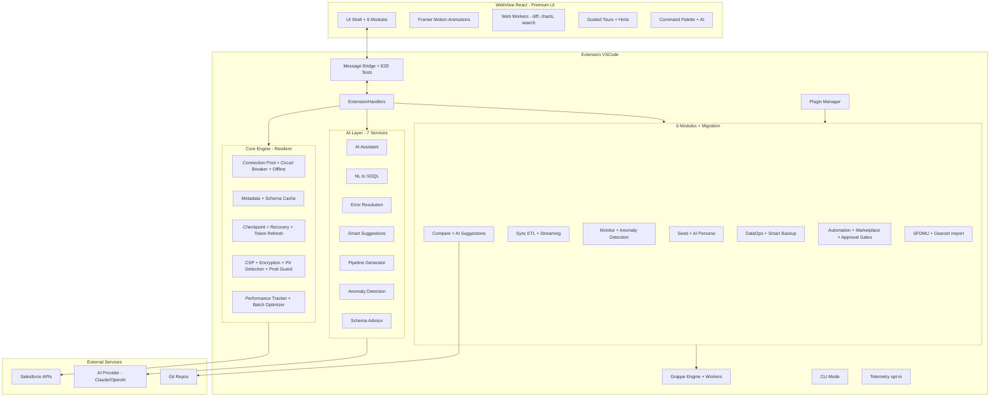

# 🔥 Plan d'Amélioration SandForge — Vers un Outil Intelligent et Performant

**Date** : 2026-02-26
**Objectif** : Transformer SandForge d'un outil fonctionnel (score 7.5/10) en un outil intelligent, performant et production-ready (cible 10/10)
**Prompt Claude Code** : [`CLAUDE-CODE-PROMPT.md`](CLAUDE-CODE-PROMPT.md)

---

## 📊 Diagnostic Actuel

### Forces identifiées
- Architecture modulaire solide (6 modules + core engine)
- 3 197 tests, couverture > 97% sur extension et shared
- Bridge Extension↔WebView connecté via ExtensionHandlers (78KB, 14+ handlers)
- AI Assistant intégré (Anthropic API)
- Mode Grappe complet (7 composants, 7 stratégies de partitionnement)
- CLI opérationnel (8 commandes, 4 formats)
- 27 composants UI dans components/ui/
- CommandPalette, Home Page, Welcome/Onboarding existants
- Design System CSS avec tokens VSCode

### Faiblesses critiques

```mermaid
graph TD
    A[SandForge 7.5/10] --> B[Resilience 3/10]
    A --> C[Integration E2E 4/10]
    A --> D[i18n 5/10]
    A --> E[Security 6/10]
    A --> F[Features v3 manquantes]
    A --> G[Onboarding basique]
    A --> H[Design pas premium]
    A --> I[Automatisation limitée]
    
    B --> B1[Pas de Checkpoint Recovery]
    B --> B2[Token Refresh absent]
    B --> B3[Mode Offline non implémenté]
    
    C --> C1[Tests integration E2E absents]
    
    D --> D1[2/6 langues seulement]
    
    E --> E1[CSP extension manquant]
    E --> E2[Encryption at rest absent]
    E --> E3[Pas de détection PII auto]
    
    F --> F1[SFDMU Import]
    F --> F2[Pipeline Marketplace]
    F --> F3[NL to SOQL]
    F --> F4[AI Error Resolution]
    
    G --> G1[3 steps seulement]
    G --> G2[Pas de guided tours]
    G --> G3[Empty states basiques]
    
    H --> H1[Pas de micro-animations]
    H --> H2[Composants UI manquants]
    H --> H3[Pas de glassmorphism]
    
    I --> I1[Pas de dry run]
    I --> I2[Pas d approval gates]
    I --> I3[Triggers limités]
```

---

## 🎯 10 Phases d'Amélioration — 80+ Suggestions

### PHASE A — Résilience et Fiabilité (6 tâches)
1. CheckpointManager avec auto-save, TTL, recovery prompt
2. TokenRefresher avec refresh proactif et circuit breaker
3. Mode Offline complet avec queue d'opérations
4. Connection Resilience avancée avec métriques de latence
5. Tests d'intégration E2E Bridge (8 flux testés)
6. Couverture > 85% sur tous les fichiers

### PHASE B — Intelligence IA Avancée (7 tâches)
7. Natural Language to SOQL avec validation schema
8. AI Error Resolution avec apprentissage
9. AI Persona pour Seed (10 personas built-in + custom)
10. Smart Suggestions contextuelles par module
11. AI Pipeline Generator depuis description texte
12. Data Anomaly Detection (outliers, patterns, doublons)
13. AI Schema Advisor avec score de santé

### PHASE C — Performance et Scalabilité (6 tâches)
14. Streaming Bulk API avec backpressure
15. Auto Batch Size Optimizer dynamique
16. Code Splitting WebView avec prefetch
17. Virtual Scrolling pour 100K+ lignes
18. Web Workers pour calculs lourds (diff, charts, search)
19. Métriques de performance intégrées

### PHASE D — Sécurité et Compliance (5 tâches)
20. CSP Strict avec nonce
21. Détection PII automatique (email, phone, SSN, etc.)
22. Audit Trail enrichi avec export CSV/JSON/PDF
23. Encryption at rest AES-256-GCM
24. Production Safety Guard avec double confirmation

### PHASE E — UI/UX Design Premium (10 tâches)
25. Home Page Dashboard enrichi avec KPI animées
26. Micro-interactions et animations (FadeIn, CountUp, Confetti)
27. Design System enrichi (glassmorphism, gradients, glow)
28. 12 nouveaux composants UI (Stepper, Timeline, Drawer, etc.)
29. CommandPalette améliorée avec catégories et AI
30. Favoris et raccourcis avec drag & drop
31. Undo/Redo universel dans tous les wizards
32. Drag & Drop avancé (pipelines, mappings, favoris)
33. Notifications enrichies avec actions et groupement
34. Dark/Light theme toggle

### PHASE F — Automatisation Avancée (6 tâches)
35. Pipeline Marketplace (15 templates built-in)
36. Pipeline Dry Run avec rapport d'impact
37. Approval Gates avec multi-approbateur
38. Triggers intelligents (6 nouveaux types)
39. Pipeline Versioning Git-like
40. Scheduled Operations Dashboard calendrier

### PHASE G — Onboarding et Premier Contact (6 tâches)
41. Onboarding interactif 5 étapes avec animations
42. Guided Tours par module (7 tours)
43. Hints contextuels améliorés
44. What's New visuel avec screenshots
45. Empty States engageants avec illustrations SVG
46. Help Center intégré avec FAQ et recherche

### PHASE H — Extensibilité et Écosystème (7 tâches)
47. Import SFDMU avec wizard
48. Import Gearset
49. Import/Export CSV/JSON universel
50. Plugin API avec extension points
51. CI/CD Examples (GitHub, GitLab, Jenkins, Azure)
52. .sandforge.example.json documenté
53. Telemetry opt-in anonyme

### PHASE I — i18n, Accessibilité et Branding (6 tâches)
54. 4 langues supplémentaires (de, es, ja, pt-BR)
55. Accessibilité WCAG 2.1 AA complète
56. Logo SVG animé SandForge
57. Loading Screen branded
58. About Dialog avec easter egg
59. Locale-aware formatting (nombres, dates, devises)

### PHASE J — Documentation et Polish Final (5 tâches)
60. CHANGELOG.md v2.0.0 complet
61. README.md avec screenshots et badges
62. DECISIONS.md mis à jour
63. AUDIT.md v2 avec nouveau score
64. Validation finale complète

---

## 📈 Score Cible par Catégorie

| Catégorie | Avant | Après | Delta |
|-----------|-------|-------|-------|
| Architecture | 9/10 | 10/10 | +1 |
| Tests | 9/10 | 9.5/10 | +0.5 |
| Modules métier | 9/10 | 10/10 | +1 |
| Intelligence IA | 4/10 | 9.5/10 | +5.5 |
| Intégration E2E | 4/10 | 9/10 | +5 |
| Résilience | 3/10 | 9.5/10 | +6.5 |
| Sécurité | 6/10 | 9.5/10 | +3.5 |
| i18n | 5/10 | 9.5/10 | +4.5 |
| UX/Design | 7/10 | 9.5/10 | +2.5 |
| Performance | 7/10 | 9.5/10 | +2.5 |
| Automatisation | 7/10 | 9.5/10 | +2.5 |
| Onboarding | 5/10 | 9.5/10 | +4.5 |
| Branding | 6/10 | 9/10 | +3 |
| Documentation | 6/10 | 9.5/10 | +3.5 |
| **GLOBAL** | **7.5/10** | **9.6/10** | **+2.1** |

---

## 🏗️ Architecture Cible

---

*Ce plan est conçu pour être exécuté par Claude Code en mode agent autonome, phase par phase. Le prompt complet est dans [`CLAUDE-CODE-PROMPT.md`](CLAUDE-CODE-PROMPT.md).*
