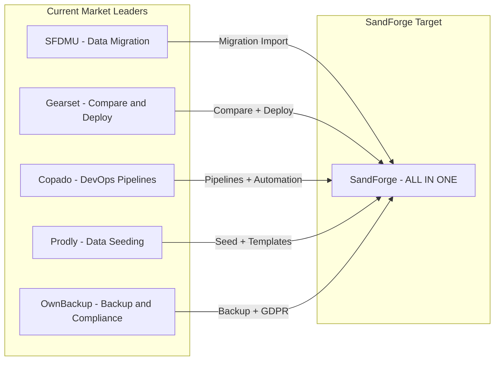
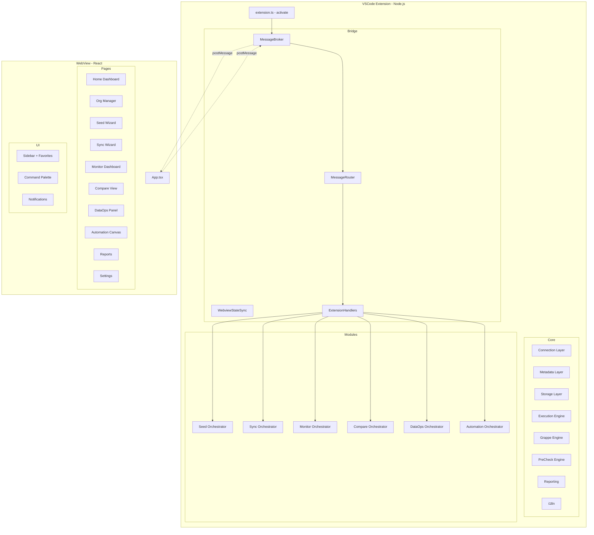

# 🔥 SandForge — Best-in-Class Improvement Plan

**Date**: 2026-02-26  
**Current Score**: 7.5/10  
**Target Score**: 9.5/10  
**Current State**: 75-80% of spec implemented, 3,197 tests, 97%+ coverage  

---

## Executive Summary

SandForge has an **excellent architecture** and **outstanding test coverage**, but it is currently a **beautiful shell with no real functionality**. The Extension↔WebView bridge exists and is tested in isolation, but **no module actually uses it**. The WebView renders, navigation works, but clicking any button does nothing.

To become the **best Salesforce DevOps tool on the market** — surpassing SFDMU, Gearset, Copado, Prodly, and OwnBackup — we need to execute 4 tiers of improvements in order.

---

## Current State Analysis

### What Works Well ✅
- **Architecture**: Modular monorepo with 3 packages, clean separation of concerns
- **Type Safety**: Zero `any`, Zod validation everywhere, 16 type files in shared
- **Test Coverage**: 3,197 tests, 243 test files, 97%+ statement coverage
- **6 Module Orchestrators**: Seed, Sync, Monitor, Compare, DataOps, Automation — all complete
- **Grappe Engine**: 7 components, 7 partitioning strategies — complete
- **PreCheck Engine**: 11 checks — complete
- **CLI**: 8 commands, 4 output formats — complete
- **WebView UI**: 10 pages, 30+ UI components, Sidebar, TopBar, StatusFooter
- **i18n**: English + French from day 1

### What Is Broken ❌
- **Bridge NOT connected**: Infrastructure exists but no module subscribes to messages
- **Pages are static**: No WebView page calls `useSendMessage` or `useMessageListener`
- **WebviewStateSync not instantiated** in `extension.ts` — FIXED in v1.1.0
- **No Home page**: Users land on nothing
- **No global search**: No Cmd+K palette

### What Is Missing 🔲
- **5 core engine files**: CompositeApiManager, CheckpointManager, RollbackManager, QueueManager, WorkerPool
- **2 connection files**: OrgHealthProbe, TokenRefresher
- **2 metadata files**: SchemaDriftDetector, PolymorphicResolver
- **3 storage files**: Database (SQLite), MigrationRunner, CacheManager
- **4 Grappe adapters**: Compare, DataOps, Monitor, Automation
- **4 i18n locales**: de, es, ja, pt-BR
- **SFDMU/Gearset importers**: Zero migration path from competitors
- **v3 features**: Three-way compare, CDC live sync, pipeline marketplace, etc.
- **Templates**: No built-in examples for users
- **`.sandforge.example.json`**: No team config example

---

## Competitive Analysis

### Feature Parity Matrix

| Feature | SFDMU | Gearset | Copado | Prodly | OwnBackup | SandForge Now | SandForge Target |
|---------|-------|---------|--------|--------|-----------|---------------|-----------------|
| Data Seeding | ⚠️ | ❌ | ❌ | ✅ | ⚠️ | ✅ | ✅ |
| Data Sync/ETL | ✅ | ❌ | ⚠️ | ⚠️ | ❌ | ✅ | ✅ |
| Metadata Compare | ❌ | ✅ | ✅ | ❌ | ❌ | ✅ | ✅ |
| Deployment | ❌ | ✅ | ✅ | ❌ | ❌ | ⚠️ | ✅ |
| Monitoring | ❌ | ⚠️ | ⚠️ | ❌ | ❌ | ✅ | ✅ |
| Backup/Restore | ❌ | ❌ | ❌ | ❌ | ✅ | ✅ | ✅ |
| GDPR/Anonymization | ❌ | ❌ | ❌ | ❌ | ✅ | ✅ | ✅ |
| Automation Pipelines | ❌ | ❌ | ✅ | ❌ | ❌ | ✅ | ✅ |
| AI-Powered | ❌ | ❌ | ❌ | ❌ | ❌ | ✅ | ✅ |
| Cluster Processing | ❌ | ❌ | ❌ | ❌ | ❌ | ✅ | ✅ |
| CLI/CI-CD | ✅ | ✅ | ✅ | ❌ | ❌ | ✅ | ✅ |
| Free/Open Source | ✅ | ❌ | ❌ | ❌ | ❌ | ✅ | ✅ |
| VSCode Native | ✅ | ❌ | ❌ | ❌ | ❌ | ✅ | ✅ |

**SandForge's unique value**: The ONLY tool that combines ALL of these in a single free VSCode extension.

---

## Improvement Tiers

### TIER 1 — CRITICAL: Make It Actually Work

> **Goal**: A user can install the extension, connect an org, and perform real operations.

These are **blocking for any release**. Without them, SandForge is a demo, not a tool.

#### 1.1 Wire Extension↔WebView Bridge End-to-End

**Problem**: [`ExtensionHandlers`](packages/extension/src/bridge/ExtensionHandlers.ts:37) registers handlers, but the WebView pages never send messages to trigger them.

**Solution**:
1. In each WebView page, replace static/mock data with calls to [`useSendMessage()`](packages/webview/src/hooks/useMessageBus.ts) and [`useMessageListener()`](packages/webview/src/hooks/useMessageBus.ts)
2. Create a [`useBridgeQuery()`](packages/webview/src/hooks/) hook that wraps send+listen in a request/response pattern
3. Wire up [`BridgeProvider`](packages/webview/src/bridge/BridgeProvider.tsx) at the App root

**Files to modify**:
- `packages/webview/src/pages/OrgManager/OrgManagerPage.tsx` — send `org:list`, `org:connect`, `org:disconnect`
- `packages/webview/src/pages/Monitor/MonitorPage.tsx` — send `monitor:refresh`, listen `monitor:data`
- `packages/webview/src/pages/Seed/SeedPage.tsx` — send `seed:execute`, listen `seed:progress`
- `packages/webview/src/pages/Sync/SyncPage.tsx` — send `sync:execute`, listen `sync:progress`
- `packages/webview/src/pages/Compare/ComparePage.tsx` — send `compare:execute`, listen `compare:result`
- `packages/webview/src/pages/DataOps/DataOpsPage.tsx` — send `backup:execute`, `dataops:anonymize`, etc.
- `packages/webview/src/pages/Automation/AutomationPage.tsx` — send `pipeline:execute`, listen `pipeline:progress`
- `packages/webview/src/pages/Settings/SettingsPage.tsx` — send `settings:get`, `settings:update`
- `packages/webview/src/pages/Reports/ReportsPage.tsx` — send `reports:list`, listen `reports:data`

#### 1.2 Implement Missing Core Engine Files

**Files to create** (with tests):
- `packages/extension/src/core/engine/CompositeApiManager.ts` — Composite + Graph API for related records
- `packages/extension/src/core/engine/CheckpointManager.ts` — Save/restore operation state for crash recovery
- `packages/extension/src/core/engine/RollbackManager.ts` — Transactional rollback with savepoints
- `packages/extension/src/core/engine/QueueManager.ts` — Priority queue for operations
- `packages/extension/src/core/engine/WorkerPool.ts` — Worker thread management

#### 1.3 Implement Missing Connection Files

**Files to create** (with tests):
- `packages/extension/src/core/connection/OrgHealthProbe.ts` — Periodic ping to check org connectivity
- `packages/extension/src/core/connection/TokenRefresher.ts` — Auto-refresh tokens before expiration

---

### TIER 2 — HIGH VALUE: Make It Delightful

> **Goal**: First-class UX that makes users never want to go back to other tools.

#### 2.1 Home Page / Dashboard

Create `packages/webview/src/pages/Home/HomePage.tsx` with:
- Connected orgs overview with status badges
- Quick action buttons: Quick Seed, Quick Sync, Refresh Monitor
- Recent operations timeline
- Health score summary for connected orgs
- Getting started guide for new users

#### 2.2 Global Search Palette — Cmd+K

Create `packages/webview/src/components/CommandPalette/CommandPalette.tsx`:
- Search across: orgs, SF objects, templates, pipelines, reports, settings, docs
- Keyboard shortcut: Ctrl+K / Cmd+K
- Fuzzy matching with highlighted results
- Recent searches
- Quick actions from search results

#### 2.3 Favorites & Quick Actions in Sidebar

Enhance [`Sidebar.tsx`](packages/webview/src/layouts/Sidebar/Sidebar.tsx):
- Favorites section: pin any template, org, pipeline, config
- Quick Actions section: last used template, refresh monitor, run last pipeline
- Recent Operations section: last 5 operations with status

#### 2.4 Missing Metadata Files

- `packages/extension/src/core/metadata/SchemaDriftDetector.ts` — Detect schema changes between snapshots
- `packages/extension/src/core/metadata/PolymorphicResolver.ts` — Resolve WhoId, WhatId polymorphic lookups

#### 2.5 Missing Storage Files

- `packages/extension/src/core/storage/Database.ts` — SQLite wrapper using better-sqlite3
- `packages/extension/src/core/storage/MigrationRunner.ts` — Schema migration runner
- `packages/extension/src/core/storage/CacheManager.ts` — Multi-layer cache (memory + SQLite)

#### 2.6 Missing Grappe Adapters

- `packages/extension/src/modules/compare/CompareGrappeAdapter.ts`
- `packages/extension/src/modules/dataops/DataOpsGrappeAdapter.ts`
- `packages/extension/src/modules/monitor/MonitorGrappeAdapter.ts`
- `packages/extension/src/modules/automation/AutomationGrappeAdapter.ts`

#### 2.7 Undo/Redo for Wizard Configs

Create a `useHistoryStore` Zustand middleware that tracks state changes in wizards, enabling Ctrl+Z / Ctrl+Y.

---

### TIER 3 — COMPETITIVE EDGE: Beat Every Competitor

> **Goal**: Features that no single competitor offers, making SandForge the obvious choice.

#### 3.1 Migration from Competitors

- **SFDMU Importer**: Read `export.json` and convert to SandForge Sync config
  - Map ScriptObject → SyncObjectConfig
  - Map externalId → ExternalIdManager config
  - Map fieldMapping → FieldMapping config
  - Map valuesMapping → TransformRule
  - Map beforeAddons/afterAddons → pre/post scripts
  
- **Gearset Importer**: Import comparison reports to bootstrap Compare configs

#### 3.2 Advanced Compare Features

- **Three-way Compare**: Compare Prod vs UAT vs Dev simultaneously
- **Compare with Git**: Compare org metadata against a Git repository
- **AI Deployment Suggestions**: After comparison, AI suggests what to deploy

#### 3.3 Advanced Sync Features

- **Bidirectional Sync**: Two-way sync with conflict resolution
- **CDC Live Sync**: Real-time sync via Change Data Capture subscription
- **Data Profiling**: Pre-sync analysis showing distribution, null %, outliers

#### 3.4 Advanced Automation Features

- **Pipeline Marketplace**: Browse and import community pipelines
- **Pipeline Versioning**: Git-like versioning with diff between versions
- **Pipeline Dry Run**: Simulate full execution without any writes
- **Approval Gates**: Human approval step that pauses pipeline execution

#### 3.5 Advanced Monitor Features

- **Custom SOQL Metrics**: Define custom metrics via SOQL queries
- **Dashboard Layouts**: Save and load custom dashboard configurations
- **Multi-Org Comparison**: Compare metrics across N orgs side by side

#### 3.6 Advanced DataOps Features

- **Smart Backup**: AI analyzes usage patterns and suggests backup priorities
- **Backup Verification**: Post-backup integrity check with checksums
- **Anonymization Live Preview**: Real-time preview while configuring rules

#### 3.7 Complete i18n

Add 4 locales to both extension and webview:
- German (de)
- Spanish (es)
- Japanese (ja)
- Brazilian Portuguese (pt-BR)

---

### TIER 4 — POLISH: Marketplace-Ready

> **Goal**: Professional-grade extension ready for the VSCode Marketplace.

#### 4.1 Test Coverage Improvements

- `DataQualityScanner.ts`: 61% → 85%+ (add tests for all 7 quality rule branches)
- `SyncPage.tsx`: 63% → 85%+ (add tests for all wizard steps)
- `TransformPipeline.ts`: 75% → 85%+ (add tests for all 4 transform modes)

#### 4.2 Integration Tests

Create `test/integration/` directory with:
- `bridge-e2e.test.ts` — Full message round-trip from WebView to Extension and back
- `seed-pipeline.test.ts` — Seed wizard → PreCheck → Execute → Report
- `sync-pipeline.test.ts` — Sync config → DryRun → Execute → Rollback
- `grappe-processing.test.ts` — Large dataset → Grappe activation → Parallel processing

#### 4.3 CI/CD Examples

Create `ci-examples/` directory:
- `github-actions.yml` — GitHub Actions workflow
- `gitlab-ci.yml` — GitLab CI pipeline
- `azure-pipelines.yml` — Azure DevOps pipeline
- `Jenkinsfile` — Jenkins pipeline

#### 4.4 Team Configuration

Create `.sandforge.example.json` with documented example of team-shared config.

#### 4.5 Built-in Templates

Create `resources/templates/` with:
- `seed/b2b-accounts.json` — B2B account hierarchy template
- `seed/b2c-contacts.json` — B2C contact with cases template
- `sync/prod-to-dev.json` — Production to Dev sync config
- `anonymize/gdpr-standard.json` — GDPR anonymization template
- `pipelines/sandbox-refresh.json` — Post-sandbox-refresh pipeline
- `grappes/high-volume-seed.json` — High volume seed grappe config

#### 4.6 Plugin/Extensibility API

Implement `SandForgePlugin` interface allowing third-party extensions to:
- Add custom seed strategies
- Add custom transformers
- Add custom pre-checks
- Add custom pipeline steps
- Add custom export formats
- Add custom connectors
- Add custom grappe strategies

#### 4.7 Security Hardening

- CSP headers for WebView
- Encryption at rest for sensitive config data
- Audit logging for all operations
- Production safety guards with typed confirmation

#### 4.8 Marketplace Polish

- Professional screenshots for each module
- Animated GIFs showing key workflows
- Badges: tests passing, coverage, license
- Detailed README with feature comparison table
- Video walkthrough link

#### 4.9 Performance Optimization

- React.lazy + code splitting per module page
- Web Workers for heavy D3/React Flow visualizations
- TanStack Table virtualization for large datasets
- Bundle size optimization: extension < 5MB, webview < 2MB

---

## Architecture Diagram

---

## Execution Order

The tiers should be executed strictly in order. Each tier builds on the previous one.

### Within TIER 1, the order is:
1. Wire bridge in `OrgManagerPage` first (simplest, validates the pattern)
2. Wire bridge in `MonitorPage` (read-only, low risk)
3. Implement missing connection files (OrgHealthProbe, TokenRefresher)
4. Wire bridge in remaining pages (Seed, Sync, Compare, DataOps, Automation)
5. Implement missing core engine files

### Within TIER 2, the order is:
1. Home page (first impression)
2. Command palette (power user feature)
3. Missing storage files (SQLite, needed for persistence)
4. Missing metadata files
5. Grappe adapters
6. Favorites + Quick Actions
7. Undo/Redo

---

## Success Metrics

| Metric | Current | Target |
|--------|---------|--------|
| Spec completion | 75-80% | 98%+ |
| Audit score | 7.5/10 | 9.5/10 |
| Integration score | 4/10 | 9/10 |
| Resilience score | 3/10 | 8/10 |
| i18n score | 5/10 | 9/10 |
| Test count | 3,197 | 4,000+ |
| Test coverage | 97% | 97%+ |
| Languages | 2 | 6 |
| Working E2E flows | 0 | 10+ |
| Marketplace rating target | N/A | 4.5+ stars |

---

## Risk Assessment

| Risk | Impact | Mitigation |
|------|--------|------------|
| Bridge wiring breaks existing tests | HIGH | Run full test suite after each page integration |
| SQLite dependency issues on different OS | MEDIUM | Use better-sqlite3 with prebuilt binaries, fallback to JSON |
| Bundle size exceeds limits | MEDIUM | Monitor with bundlesize, use dynamic imports |
| i18n translation quality | LOW | Use AI for initial translations, community review later |
| Performance with large datasets | MEDIUM | Grappe engine already handles this, add benchmarks |

---

## Conclusion

SandForge has the **strongest foundation** of any Salesforce DevOps tool in the VSCode ecosystem. The architecture, type safety, and test coverage are exemplary. The critical gap is **integration** — connecting the beautiful UI to the powerful backend.

By executing these 4 tiers in order, SandForge will become:
1. **The only all-in-one tool** — Seed + Sync + Monitor + Compare + DataOps + Automation
2. **The only free option** — Open source vs $50-500/month competitors
3. **The only VSCode-native option** — No browser tab, no separate app
4. **The only AI-powered option** — LLM-backed data generation and suggestions
5. **The only tool with cluster processing** — Grappe engine for massive datasets

This is not incremental improvement — this is **category creation**.
