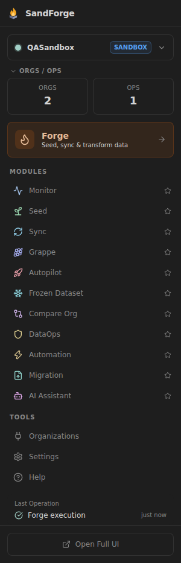
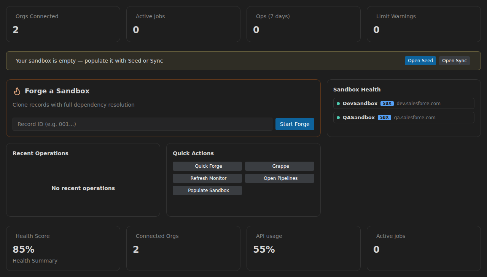
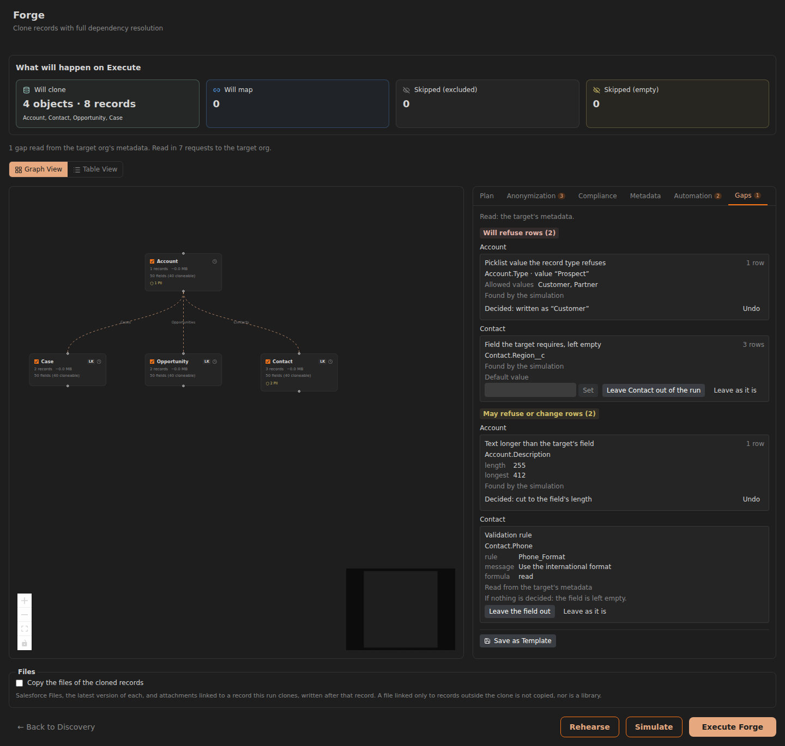

# Getting Started with SandForge

This guide walks you through installing SandForge, connecting your first Salesforce org, and running your first data operation.

---

## Prerequisites

Before you begin, make sure you have:

- **Visual Studio Code** 1.95 or later
- **Salesforce CLI** (`sf`) installed and authenticated with at least one org
- **A Salesforce sandbox or scratch org** to work with (Developer Edition works fine)
- _(Optional)_ An Anthropic (Claude) API key for AI-powered data generation

Verify your Salesforce CLI setup:

```bash
sf org list
```

You should see at least one authenticated org in the output.

---

## Installation

### From the VSCode Marketplace (recommended)

1. Open VSCode
2. Go to Extensions (`Ctrl+Shift+X`)
3. Search for **SandForge**
4. Click **Install**
5. Reload VSCode when prompted

### From a VSIX file

1. Download the latest `sandforge.vsix` from the [Releases page](https://github.com/StephaneBerthoz/sandforge/releases)
2. In VSCode, open the Command Palette (`Ctrl+Shift+P`) and run **Extensions: Install from VSIX...**
3. Select the downloaded file

---

## First Launch

After installation, you will see the SandForge flame in the VSCode Activity Bar (left edge). Click it to open the **launcher** — a narrow sidebar view, not a dashboard. Everything starts here, and each module you pick opens in its own editor tab.

Top to bottom, the launcher gives you:

- **Org switcher** -- The current org with a live status dot and its type badge (PROD, SANDBOX, SCRATCH...). Open it to list every registered org, jump to one in a browser, or pick **New organization...** at the bottom to go to Organizations.
- **Orgs / Ops** -- Two counters, connected orgs and recent operations. Collapsible, and collapsed for you on short viewports.
- **Forge** -- The orange hero button, straight into the record-scoped clone journey. This is the shortcut you will use most.
- **Favorites** -- Only shown once you star something. Every module in the list below has a star button.
- **Modules** -- Monitor, Seed, Sync, Grappe, Autopilot, Frozen Dataset, Compare Org, DataOps, Automation, Migration, AI Assistant.
- **Tools** -- Organizations, Settings, Help.
- **Running / Last Operation** -- The operation in flight, or the last one to finish with its status and age.
- **Open Full UI** -- Opens Monitor in a full editor tab.



> **Note:** the **Home** dashboard — KPI row, sandbox health, recent operations — is an in-panel view only. It has no launcher entry and no `SandForge: Open ...` command, so it is reached from inside a SandForge panel: either the `G` then `H` chord, or the SandForge command palette on `Ctrl+K` (`Cmd+K` on macOS). That palette is SandForge's own, distinct from the VSCode palette on `Ctrl+Shift+P`.



---

## Connect Your Org

1. Open **Organizations** from the launcher's Tools section, or pick **New organization...** at the bottom of the org switcher
2. The Org Manager page shows a connection banner with five auth methods:
   - **SFDX Import** -- Imports orgs already authenticated via Salesforce CLI (fastest option)
   - **OAuth Web** -- Opens a browser window for standard OAuth flow
   - **Username/Password** -- Direct login with username, password, and security token
   - **JWT** -- JWT bearer flow through `sf org login jwt`: the consumer key of a connected app or external client app that holds your certificate, a username pre-authorized on it, and the path of the private key file
   - **Device Flow** -- OAuth device flow: SandForge shows a code, opens the Salesforce page to enter it on, and waits up to ten minutes for your approval. It needs your own external client app with the device flow enabled
3. Click **SFDX Import** to import your existing CLI-authenticated orgs automatically
4. Once connected, your org appears as a card with its alias, type badge, and status dot. The badge reads PROD, SCRATCH or DEVELOPER (a Developer Edition org), the kind of a sandbox (DEV, DEV PRO, PARTIAL or FULL, or SANDBOX when the kind is not known), or, for a sandbox or a Developer Edition org, an environment tag you gave it such as UAT or QA

OAuth Web, Username/Password, JWT and Device Flow log in through `login.salesforce.com` or `test.salesforce.com`. They also accept a My Domain host (`*.my.salesforce.com`) and `*.force.com` or `*.cloudforce.com` hosts, and refuse any other login host.

JWT and Device Flow leave the session with the Salesforce CLI, as SFDX Import does: SandForge adds the one org you signed in to, and the CLI refreshes its session from then on. For JWT, SandForge passes the path of the private key file to `sf org login jwt` and never opens the file; the path must be absolute. The Salesforce CLI has had no device command since 2.119.8, and Salesforce blocks the device flow for the CLI's own connected app, so SandForge asks Salesforce for the code itself, then hands the approved session to the CLI with `sf org login sfdx-url`. The app must grant the `refresh_token` scope and accept the refresh token without the consumer secret, since the CLI refreshes the session with the consumer key alone. Salesforce no longer lets a connected app enable the device flow, and from 30 November 2026 accepts it only from a local external client app with a localhost callback URL. **Cancel sign-in** stops the wait.

An org on another Salesforce cloud (for example Government Cloud Plus, on `salesforce.mil`) is added in two steps: authenticate it with `sf org login web --instance-url <url>`, then click **SFDX Import**.

> **Tip:** Forge refuses to write to a Production org, or to any org it cannot tell is a sandbox, a scratch org or a Developer Edition org. The other modules go through Production Guard, which asks for your confirmation before any write to a Production org and blocks DELETE there.

---

## Your First Operation

The main SandForge use case: **populate a sandbox from a real record**. Let's walk through the **Forge** journey:

1. Navigate to **Forge** from the sidebar
2. Paste a root record ID in the **Record** tab (e.g. an Account from your UAT org) and pick the **Source Org** and **Target Org** (your dev sandbox)
3. Click **Discover Graph** — Forge walks the record's relationship graph (Account → Contacts, Opportunities, Cases…)
4. Tune the options: **Depth**, **Records per object**, **Anonymize PII**, excluded objects
5. Click **Review & Execute**, then **Simulate** to see what the run would write and what the target would refuse, without writing anything (see [First Steps, Safely](#first-steps-safely))
6. Click **Execute Forge** — records land in your sandbox with their IDs remapped as they are written; a record type with no active record type of the same API name on the target keeps its source Id, and the SandForge log names it

See the [Forge Quickstart](forge-quickstart.md) for the full walkthrough. It also covers the command-line clone and cleanup: two TypeScript scripts, not an installed command, run with `pnpm exec tsx` from a checkout of this repository once `pnpm install` and `pnpm build:shared` have run.

No real data to copy yet? The **Seed** module generates test data instead:

1. Navigate to **Seed** from the launcher's Modules list
2. Choose a seed mode from the mode selector: **AI Generate**, **CSV Upload**, or **Clone from Org**
3. For **AI Generate**: Select your org, pick objects, set record counts, configure field rules, then execute
4. For **CSV Upload**: Select your org and object, drag-and-drop a CSV file, map columns, validate, then execute
5. For **Clone from Org**: Select source and target orgs, pick objects to clone, preview the insertion order, then execute
6. View results with per-object record counts, error details, and export options

The **NL2SOQL** helper in Step 1 lets you describe what you want in plain English (e.g., "All accounts created this month with more than 10 employees") and generates the SOQL query for you.

---

## First Steps, Safely

Before a Forge run writes into an org you care about, in this order:

1. **Clone into a Developer sandbox or a scratch org.** Forge writes only to a sandbox, a scratch org or a Developer Edition org; it refuses a Production org, and any org it cannot tell is one of those.
2. **Simulate first.** On Review, **Simulate** takes every record through the write stage, as **Execute Forge** would, and writes nothing. Its results say _Simulation, nothing was written_, how many records a real run would insert, and how many gaps it found against the target; **Back to Review** takes you to them.
3. **Read the Automation and Gaps tabs.**
   - **Automation** lists what the target runs on the records the run writes: flows, processes, workflow rules, Apex triggers, assignment rules and duplicate rules, with what sends an email or a text message marked and, where a flow's start condition leaves out the users who hold a custom permission, that permission. When the user the run writes as does not hold it, the tab names the smallest permission set of the target that holds it, when there is one, with the command that assigns it, to copy: SandForge never runs it. The tab also says what may refuse a removal of the run's records: a flow before a delete, an Apex trigger on one, records that lock past Draft. It counts what fires on insert. A real run asks you in VS Code to confirm what fires on insert and update before it writes anything.
   - **Gaps** lists what the target would refuse or change in the rows: a picklist value, a field only the target requires, a text longer than its field, a validation rule, and more. Each gap is read from the target's metadata as Review opens, or found by a simulation or a rehearsal, and comes with the decisions it allows among these: map the value or the record type, leave it empty, set a default, cut the text, leave the object out, or leave it as it is. The tab counts the gaps that will refuse rows and have no decision yet.
4. **Emails and phone numbers are neutralized by default.** Whether the run anonymizes or not, every email address is written under `.invalid` and every phone number as a fictional one, so the target's automation reaches no one. **Keep emails and phone numbers as they are**, on the Forge page, turns that off, with a warning. The results say what was neutralized, field by field.
5. **Rehearse when the target has validation rules or triggers.** A simulation checks the rows against the target's fields; it does not run the target's validation rules or triggers. **Rehearse**, beside **Simulate**, has the target itself judge the rows, in calls it rolls back whole: every row when the run creates 200 or fewer, otherwise one row for each object, record type and set of filled fields. You confirm the calls it costs in VS Code first, and that confirmation names what a rollback cannot take back: platform events published immediately and callouts already made. What the target refused goes to the Gaps tab.
6. **Remove a run from Results.** **Remove the records this run created** deletes them from the target, children before their parents, into its recycle bin; its confirmation lists what the target runs as they are deleted. Records the run linked to, which the target already held, are kept, and so is a record that records staying in the target depend on; a record changed since the run is kept unless you include it. The runs under **Recent runs**, and under **Older runs** once they leave that list, offer the same removal.



---

## What's Next

Now that you are up and running, explore the full capabilities of each module:

- [Forge](forge-quickstart.md) -- Record-scoped clone: populate a sandbox from a real record and its relationship graph
- [Seed](modules/seed.md) -- AI generation, CSV import, and org-to-org cloning with templates and dependency resolution
- [Sync](modules/sync.md) -- Org-to-org data synchronization with field mapping and conflict resolution
- [Monitor](modules/monitor.md) -- Real-time org health, API limits, and job tracking
- [Compare](modules/compare.md) -- Metadata diff, permission set and profile presence, and five Organization settings
- [DataOps](modules/dataops.md) -- Backup, restore, anonymization, data subject requests, cleanup and a data-quality scan
- [Automation](modules/automation.md) -- Visual pipeline builder: backups, comparisons, checks, notifications, started by hand, on a schedule or on a sandbox refresh

Have questions? Check the [FAQ and Troubleshooting](faq.md) guide.
